# 1/100 simple webhook consumer
This project is a simple webhook consumer built with Java, Spring Boot, and Temporal. It demonstrates how to use Temporal workflows to process and manage webhook events reliably.

## Features
- Receives webhook events via REST API
- Processes events through Temporal workflows
- Idempotency check through Temporal by setting unique workflowId per event
- Provides durable execution with automatic retries
- Saves webhook data to AWS Dynamodb
- Handles event history and status tracking via Temporal

## Technologies
- Java
- Spring Boot
- Temporal
- DynamoDB (for event storage)
- Maven

## Sequence Diagram

```mermaid
sequenceDiagram
    participant Client
    participant WebhookAPI as Webhook API
    participant Workflow as Temporal Workflow
    participant Server as Temporal Server
    participant Worker as Temporal Worker
    participant Activity as Temporal Activity
    participant DynamoDB

    Client->>WebhookAPI: POST /webhook (event data)
    WebhookAPI->>Workflow: Start Workflow 
    Workflow->>Server: Workflow Task Recorded
    WebhookAPI-->>Client: 200 OK
    Worker->>Server: Fetch Workflow task
    Worker->>Activity: Execute Workflow Task
    Activity->>DynamoDB: Store event data
    Worker->>Server: Finished Workflow task ✅
    
    
    
 ```

## Running locally:
```


# setup temporal server:
git clone https://github.com/temporalio/docker-compose.git
cd docker-compose
docker-compose up

# run this app:
git clone https://github.com/michael-oswald/100-temporal-apps.git
cd 100-apps/app-1-webhook-consumer
./mvnw spring-boot:run

# dynamodb:
You'll need to run a local dynamodb, or create a dynamodb table in your AWS account and set the table name as example-webhooks.

# testing with curl:
curl --location 'localhost:8081/api/webhook' \
--header 'Content-Type: application/json' \
--data '{
    "webhookId":"53698243-0425-4a76-9492-909b3cb34c01",
    "data":"all kinds of important data",
    "createdAt":"2025-04-30T12:51:44.837Z"
}'
```
