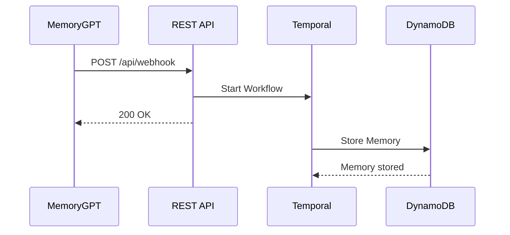

# 2/20 simple REST API for custom GPT app (using Temporal workflow for POST API)
This project is a rest api to support a custom GPT app called memory-gpt.

# Blog post link
https://michaeloswald.beehiiv.com/p/2-of-20-temporal-app-challenge-using-temporal-in-a-custom-gpt-app-bb66

# Youtube Video Link
https://youtu.be/AJso-k35Fqg

## Features
- REST API made for storing retrieving and updating your need to remember things "your memories"
- Tempora

## Technologies
- ChatGPT (for the custom GPT app)
- Java
- Spring Boot
- Temporal
- DynamoDB (for event storage)

## Sequence Diagram (POST API FLOW)


# setup temporal server:
git clone https://github.com/temporalio/docker-compose.git
cd docker-compose
docker-compose up

# run this app:
git clone https://github.com/michael-oswald/20-temporal-apps.git
cd 20-apps/app-2-memory-api
./mvnw spring-boot:run

# dynamodb:
You'll need to run a local dynamodb, or create a dynamodb table in your AWS account and set the table name as `gpt-memory`.

# testing with curl:
curl --location 'http://localhost:8081/api/memory' \
--header 'Content-Type: application/json' \
--data '{
  "userId": "exampleUserId",
  "uniqueMemoryId": "16f8df7e-0cb9-481b-9067-a69ed6ddc19e",
  "text": "This is a test memory",
  "category": "otherCategory",
  "dueAt": "2023-12-31T23:59:59",
  "status":"NEW"
}'
```
