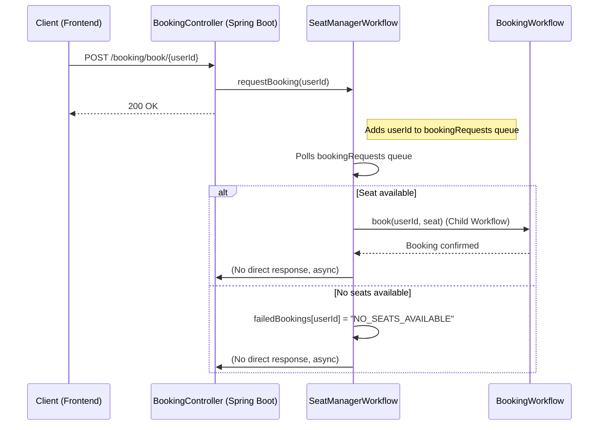

# 4/20 Flight Seat Reservation App

## ✅ Use Case
A bulletproof flight seat reservation system. Each seat can be reserved at most once, even in the presence of failures, crashes, and retries.

## 📖 Blog Post
https://michaeloswald.beehiiv.com/p/temporal-app-4-of-20-180-seats-400-people-the-last-plane-is-leaving-ea4b

## 🎥 YouTube Video
https://youtu.be/Y21kEdv6YLc?si=BLKc3AfJQ_RMNMWt

## ✨ Features
- Reserve seats with strong consistency guarantees
- Prevent double-booking, even under concurrent requests
- Built with [Temporal](https://temporal.io/) for workflow orchestration
- Java + Spring Boot backend
- React frontend for seat selection and booking
- Saves booking data in DynamoDB for confirmed user reservations

## 🛠 Technologies
- Java 17
- Spring Boot
- Temporal
- k6 load testing
- React
- Maven
- DynamoDB


# 🗂 Project Structure
src/main/java/ — Spring Boot backend and Temporal workflows
frontend/ — React frontend for seat booking
README.md — This file

# Sequqnce Diagaram


## 🚀 Running Locally
### 1. Start Temporal Server
```sh
git clone https://github.com/temporalio/docker-compose.git
cd docker-compose
docker-compose up
```

### 2. Start Backend App
```
git clone https://github.com/michael-oswald/20-temporal-apps.git
cd 20-apps/app-4-flight-booking
./mvnw spring-boot:run
```

### 3. Start the Frontend
```
cd frontend
npm install
npm start
```

### 4. DynamoDB Setup
Need a DynamoDB table for confirmed bookings. You can create it using the AWS console or AWS CLI.
Table should be named `AirlineBookings`


### 5. Run load test
```
# first install k6 (if you don't have it)
brew install k6 (mac)

# run load test:
k6 run k6loadtest.js
```
