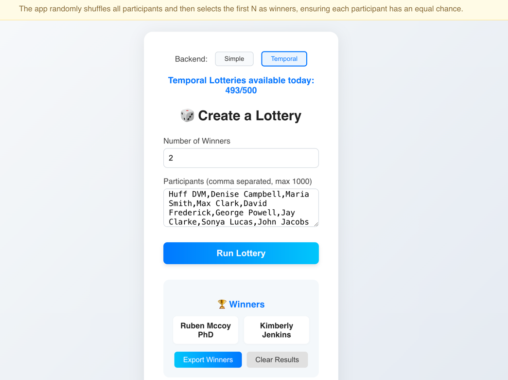
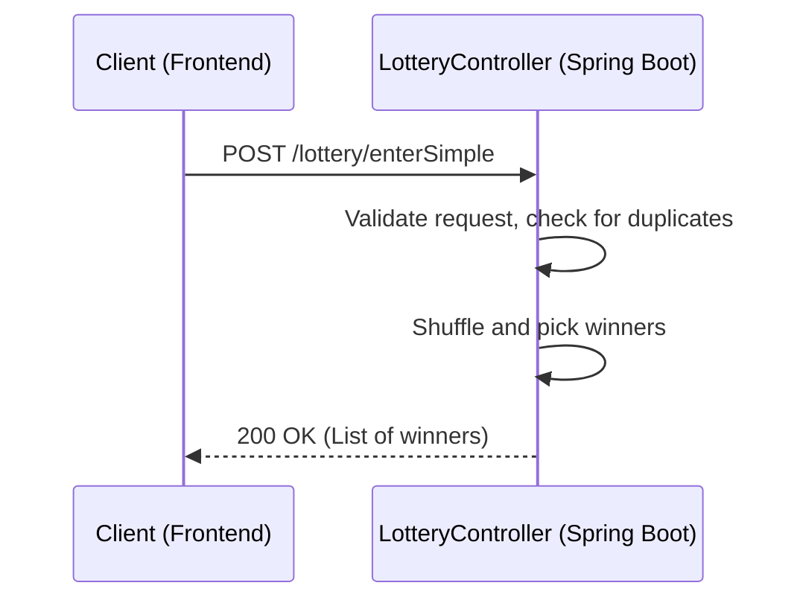
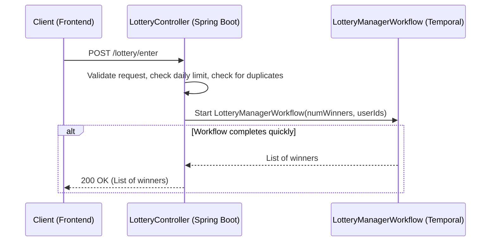

# Lottery System App (Temporal App Challenge 5/20)

## This app is a demo application for demonstration purposes only and is not intended for real production use.
## Live public url: https://www.freelotterypicker.com/


## Why I built this?
* Try out Temporal Cloud and actually deploy the app to AWS using AWS App Runner via AWS Copilot 🙌
* Learn how to manage Temporal workflows in a lottery system

## Blog URL

## Youtube Video

## ✅ Use Case
A lottery system for managing lottery draws, user enters 2 parameters: number of winners and participants. The system will randomly select winners from the participants.

## ✨ Features
- Create and manage lottery draws
- Random winner selection using Temporal workflows (simple mode)
- Random winner selection using Temporal workflows (temporal mode)
- Java + Spring Boot backend with Temporal orchestration
- React frontend for UI

## 🛠 Technologies
- Java 17
- Spring Boot
- Temporal Cloud
- React
- AWS Copilot for deployment to AWS App Runner

## 🗂 Project Structure
- `src/main/java/` — Spring Boot backend and Temporal workflows
- `frontend/` — React frontend for lottery system

## 📝 Sequence Diagrams

### Simple Lottery (No Temporal Workflow)


### Temporal Lottery (With Workflow)


# 🚀 Running Locally
1. Start Temporal Server
```
git clone https://github.com/temporalio/docker-compose.git
cd docker-compose
docker-compose up
```

2. Start Backend App
```bash
./mvnw spring-boot:run
```

3. Visit the Frontend
```bash
localhost:3000
```

# 🚢 Deploying with AWS Copilot
```
copilot init
copilot svc deploy
```
See my other youtube video for more details on how to deploy with AWS Copilot:
https://youtu.be/fPZf_2rKmkQ?si=whOHXJTWWl1sxHn7
